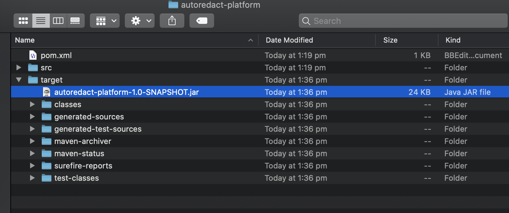
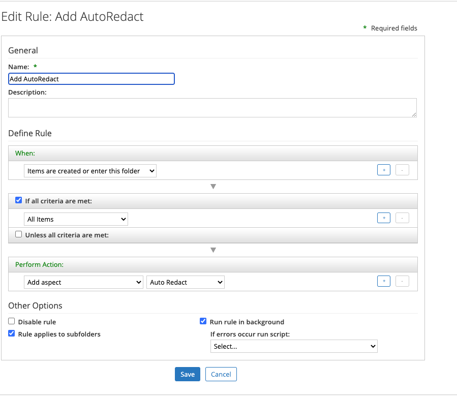

#### This article explains the steps required to deal with auto redacting content with Alfresco Enterprise viewer. 

### Use-Case / Requirement
Contents stored in ACS have to be auto redacted after uploading. Therefore use case have been achieved using a java based scheduled jobs based on custom aspect added to the docuent while uploading.

### Pre- requisites
Alfresco Enterprice Viewer has to be installed and configured in your environment.

## Configuration Steps

### ACS : Custom Script Development
1. Navigate to autoredact > autoredact-platform in command line and execute  'mvn clean install'.
2. view the `target` folder.


Note: If you requored any changes to be made you can modify the code before building.

### ACS : Custom Script Deployment
1. Browse to the `classpathRoot` directory.
For example, for Tomcat 6, browse to the `$TOMCAT_HOME/shared/classes/` directory.

2. Update `alfresco-global.properties` as follows:
```
# Scheduled - Job
//If redaction to be made only in specific folder
redact.parentnodeId=2980ad9f-ca80-4e07-9e09-2a49db4391cb

//set this to 'false' if redaction has to be made on every file which has custom aspect set.When having true it checkes only documents lies under parentnode.
redact.folder.check=true
redact.pattern=(^\\d{3}-?\\d{2}-?\\d{4}$|^XXX-XX-XXXX$)

# Run every minute
redact.scheduledjob.cronexpression=0 * * * * ?
redact.scheduledjob.enabled=true
```

3. Deply the jar file into tomcat/webapps/WEB-INF/lib

4. Restart Content (ACS Server).

### ACS : Setup Email Template
1. Login to Share. Navigate to Admin Tools > Model Manager. Custom Model can be found [here.](Redact.zip)
2. Import the Model `Redact.zip`. And make it Active. 

### ACS : Setup FOLDER RULES
1. Create a `Folder Rule` to add an aspect named `Auto Redact`.


2. Add Documents to the folder
### ACS : RUN the DEMO
